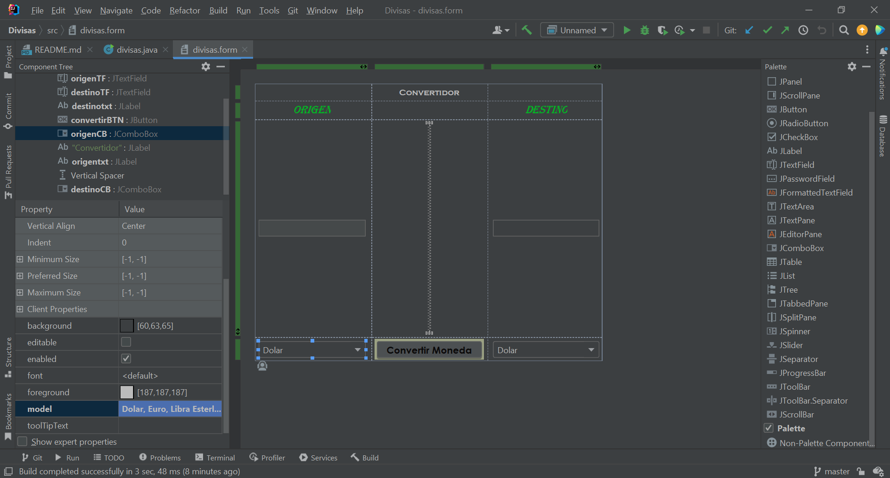
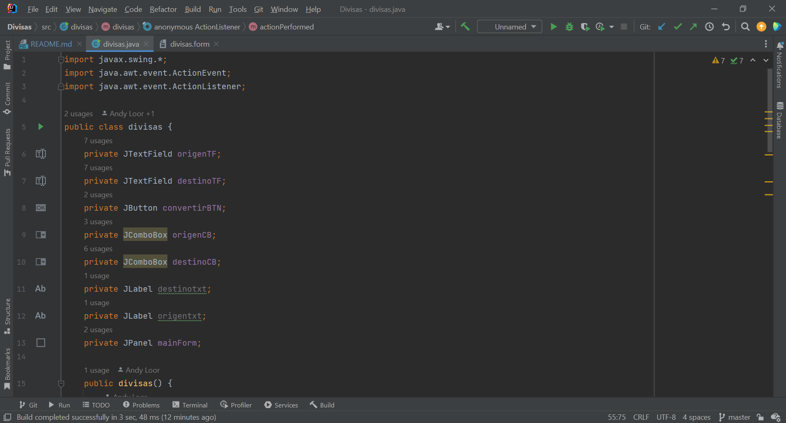
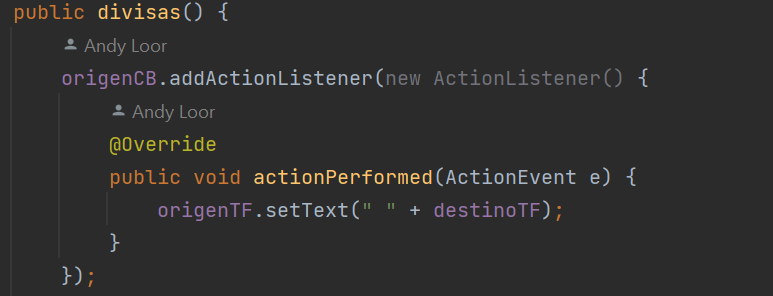
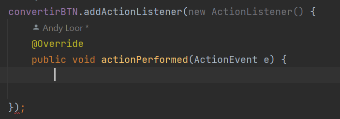
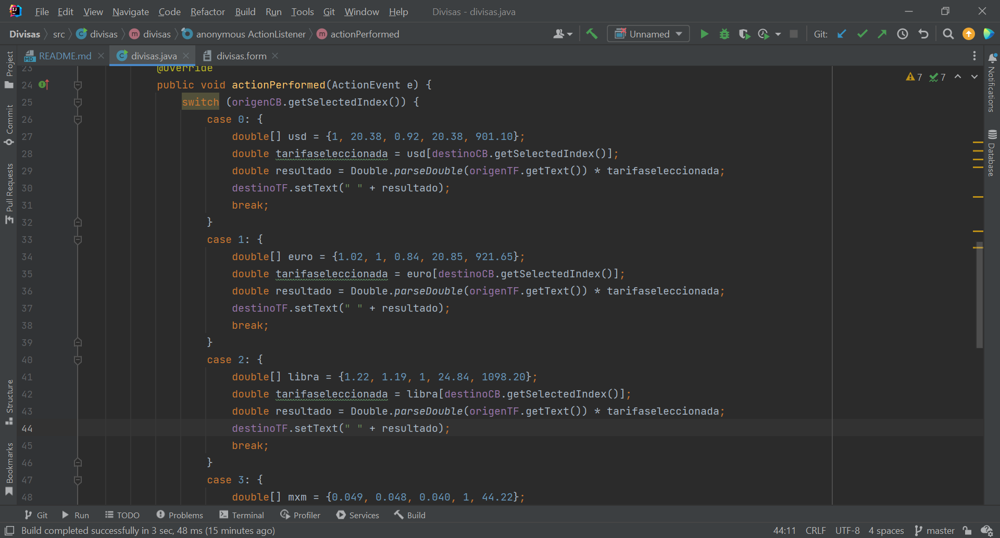
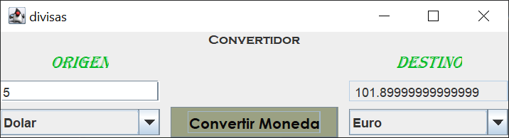

# Divisas_Convertidor
LOOR ANDY - BALLESTEROS ISMAEL

1.- CREACION DEL PROTOTIPO DEL FORMULARIO DE CAMBIO DE DIVISAS.

2.- APARTEDO DE LAS VARIABLES DE CADA UNO DE LOS COMPONETES DE PROTOTIPADO.

3.- CREACION DEL ACTIONLISTENER DEL ORIGEN DEL CONTENIDO DEL COMBOBOX.

4.- CREACION DEL ACTIONLISTENER DEL CONVERTIDOR DEL CONTENIDO DEL JBUTTON.

5.- CREACION DE CADA UNO DE LOS METODOS DE CAMBIO DE DIVISAS.

6.- FUNCIONAMIENTO DEL PROGRAMA DE CAMBIO DE DIVISAS.
